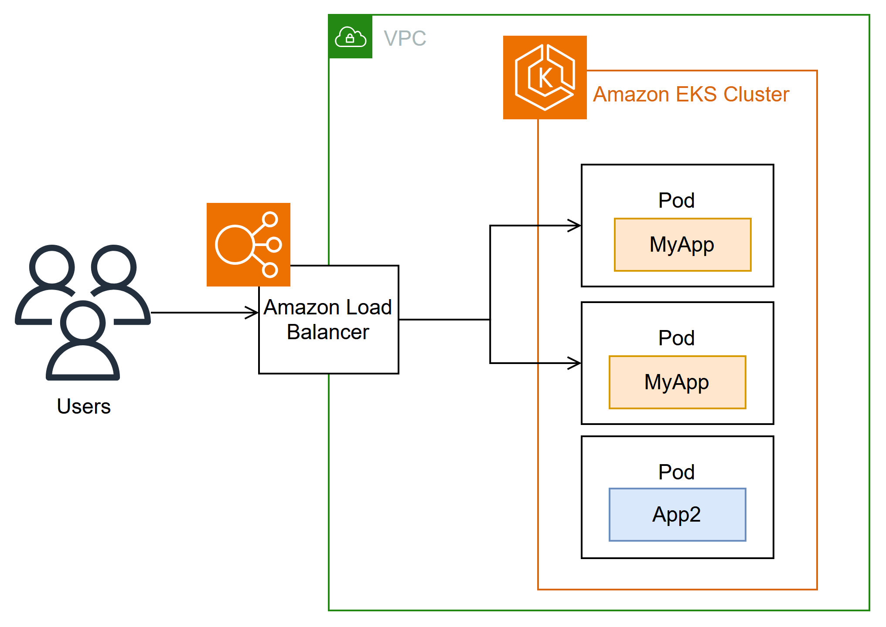

# This repository holds Terraform configs for AWS infrastucture

## To run locally:
1. Set AWS account env vars:

   `export AWS_PROFILE=` or set [AWS credentials](https://docs.aws.amazon.com/cli/v1/userguide/cli-configure-files.html)

   `export AWS_REGION=`

2. `git clone https://github.com/karshkoff/j-llm-infra.git`
3. `cd j-lmm-infra`
4. `terraform init -backend-config=dev.s3.tfbackend`
5. `terraform apply`
6. `kubectl delete -f ollama/ollama-ingress.yaml`
7. `terraform destroy` after using, to reduce costs

## Log in EKS
1. `aws eks update-kubeconfig --name j-llm --region ${AWS_REGION} --profile ${AWS_PROFILE} --alias j-llm`
2. `kubectl config use-context j-llm`
3. `kubectl get nodes`

